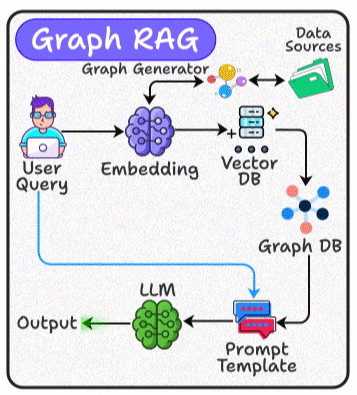

# Haystack Neo4j Recommendation Movie System

 

# Install Docker dnf5
# Docker
sudo dnf config-manager addrepo --from-repofile=https://download.docker.com/linux/fedora/docker-ce.repo

sudo dnf install docker-ce docker-ce-cli containerd.io docker-buildx-plugin docker-compose-plugin
sudo systemctl enable --now docker
sudo usermod -aG docker $USER
sudo docker run hello-world

# Install Docker Desktop
cd tmp
wget -O docker-desktop-x86_64.rpm https://desktop.docker.com/linux/main/amd64/docker-desktop-x86_64.rpm?utm_source=docker&utm_medium=webreferral&utm_campaign=docs-driven-download-linux-amd64
sudo dnf install ./docker-desktop-x86_64.rpm

# Install uv
curl -LsSf https://astral.sh/uv/install.sh | sh

docker compose up -d
# or
docker compose -f path_to_fole up -d

->/neo4j_home directory structure
    /conf
    /data
    /import
    /logs
    /plugins

# Download file and copy to ->/neo4j_home/plugins
wget https://github.com/neo4j/apoc/releases/download/2025.11.2/apoc-2025.11.2-core.jar
# wget https://github.com/neo4j/apoc/releases/download/5.26.19/apoc-5.26.19-core.jar

Copy ./data/normalized_data to  /neo4j_home/import/normalized_data

# Download Neo4jDesktop from https://neo4j.com/docs/desktop/current/installation/    AppImage for Linux
# chmod +x filename

# Clone github repository
git clone https://github.com/jupiterfirepower/HaystackNeo4jRecommendationMovieSystem.git

uv venv
source .venv/bin/activate  # On macOS/Linux
# uv add -r requirements.txt
uv pip install -r requirements.txt
# uv sync

# Run graph_build.py from Dev IDE or terminal (Developing and tested in Python3.14)
uv run graph_build.py

# Install ollama and pull models
curl -fsSL https://ollama.com/install.sh | sh
# or
wget https://ollama.com/install.sh
./install.sh

# For Nvidia video card(GPU)
sudo dnf config-manager addrepo --from-repofile=https://developer.download.nvidia.com/compute/cuda/repos/fedora42/x86_64/cuda-fedora42.repo
sudo dnf update
sudo dnf install cuda-toolkit

sudo systemctl status ollama.service

# ollama pull deepseek-r1:1.5b
# ollama stop deepseek-r1:1.5b
ollama pull mxbai-embed-large
# ollama pull nomic-embed-text

uv run generate_embeddings.py
# It's may continue 1-1.5 hours or less depend on hardware(processor etc)

uv run graph_rag_recommend_search.py

